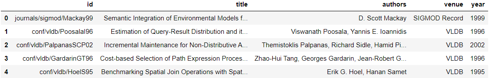
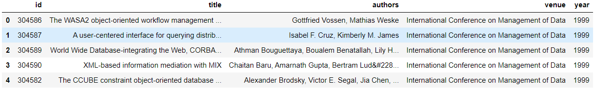
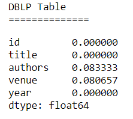
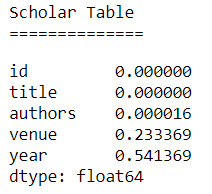
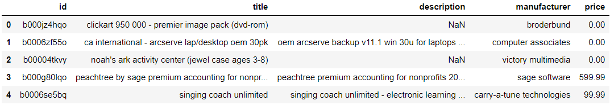
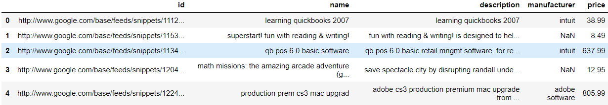
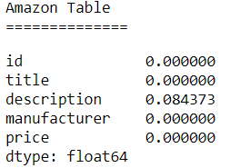
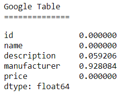

## Introduction
Imagine you work at a hospital. You are treating a patient named John Doe and you need to look up his medical records. Upon searching the database, you stumble across this:

How can we tell if John Doe from Hospital A is referring to the same John Doe from Hospital B? This is an example of a record linkage problem, the process of finding records across different data sets that correspond to the same entity. Without a distinct identifier (think ID for each patient) for an entity, this becomes a non-trivial problem. In our current age of big data, where data is becoming increasingly large and heterogeneous, being able to merge multiple datasets together accurately is an important task.  

There are two primary schools of thought when it comes record linkage - deterministic record linkage and probabilistic record linkage. Deterministic record linkage uses rule-based algorithms, predicting that two records refer to the same entity if certain rules or thresholds are met. For example, one might say two records of patients from two different hospital data sets refer to the same entity if the name, date of birth, and city match exactly.
As we can see from the example above, data sets can be noisy - different establishments may have different conventions for inputting data. Other forms of noise can come from missing data entries, incorrect data entries, or duplicate records. Clearly, deterministic record linkage will be difficult if the data is not clean. On the other hand, probabilistic record linkage weights columns differently, depending on their ability to predict whether records refer to the same entity. Using these weights, a probability is calculated for two records corresponding to the same entity. While this is a more robust framework than deterministic record linkage, this is still heavily reliant on clean data. Previous research on record linkage have studied these approaches, incorporating methods from NLP/linguistics, as well as using machine learning.

Our work on record linkage uses machine learning to incorporate information from different data sets, using the information as features for our model. Specifically, we use heterogeneous graphs to represent our data sets, capturing information on records and their attributes. We frame this as an edge prediction problem, where the edge is whether or not nodes from distinct data sets refer to the same entity. We believe that the graphical representation will improve on traditional models of record linkage, because it allows for the expression of more complicated relationships between entities that a tabular model may not able to represent. A graphical model is also more modular, allowing for development within this project to be more easily generalizable. An example of how a graphical approach improves on a tabular is that adding multiple relations to the graph becomes more natural. Similarly, feature representation within a graphical framework is more flexible, such as representing an address based on its subparts (address, city, state, zip code). This allows for matching even in cases that there are errors within the relation, such as incorrect spelling or missing data, which negates some of the problems found in deterministic and probabilistic record linkage.

While heterogeneous graphs have been studied and used for record linkage, we use a novel approach which incorporates node2vec, a graph embedding algorithm inspired by word2vec. This algorithm presents the ability to output similar embeddings for nodes with similar contexts.

## Datasets and EDA
We used a total of 5 data sets for this project - 4 are small data sets from the University of Leipzig that are meant to "toy" with record linkage and a large author disambiguation data set from the KDD Cup 2013 Kaggle competition, which was a challenge to find author entities in data sets that contained information on journals and conferences. We used the small data sets as performance and robustness tests on our framework and saved the large data set as the one we ultimately collect results. The four smaller datasets that we will be looking at are from [Leipzig Universities Database Department](https://dbs.uni-leipzig.de/research/projects/object_matching/benchmark_datasets_for_entity_resolution). Each dataset is sampled from real world examples and the noise in each one varies differently. These datasets are primarily used as benchmarks for testing different entity resolution techniques hence, they will be ideal to evaluate our model. In particular, two of these datasets are directly associated with the author disambiguation data set we will be using for our final implementation, as these datasets deal with linking books and authors. The following datasets follow a similar format, comprising of two separate datasets and a file that describes the matching entities between the two datasets.

### Small Data Sets
The 4 small data sets we used are: DBLP-ACM, DBLP-Scholar, Abt-Buy, and Amazon-Google.

The two small data sets similar to the Kaggle data set are the DBLP-ACM and DBLP-Scholar data sets - they each contain two data sets, which has information on ID, title of the paper, authors, venue of the conference, and year of publication. 
<b>DBLP</b>

<b>ACM</b>

While the DBLP-ACM data set has no missing values, the DBLP-Scholar data set differs. 
<b>DBLP Table NaN's</b> 
 
<b>Scholar Table NaN's</b> 

The other two small datasets contain products and their descriptions from two different marketplaces. Unlike the DBLP and author disambiguation data set, there are complex textual features represented by product names and their descriptions. For example, let's look at the Amazon-Google data set. 
<b>Amazon</b>

<b>Google</b>

Both the Abt-Buy and Amazon-Google data sets have a variety of missing values in their tables. 
<b>Abt</b> 
 
<b>Buy</b> 
  

<b>Amazon</b> 
 
<b>Google</b> 

### Author Disambiguation Data Set

## Description of our graphs and how we created it
--Shinu--

## Baseline Models
--wesley--

## Description of our final model
--Shinu--

## Results
--Wesley--

## Any improvements we could have made
--Shinu--

## Citations
insert here
