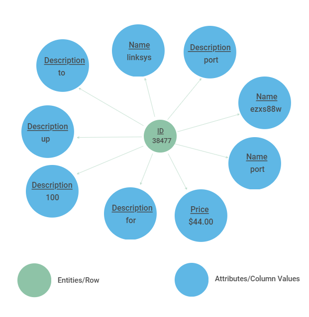

## Introduction
Imagine you work at a hospital. You are treating a patient named John Doe and you need to look up his medical records. Upon searching the database, you stumble across this:

How can we tell if John Doe from Hospital A is referring to the same John Doe from Hospital B? This is an example of a record linkage problem, the process of finding records across different data sets that correspond to the same entity. Without a distinct identifier (think ID for each patient) for an entity, this becomes a non-trivial problem. In our current age of big data, where data is becoming increasingly large and heterogeneous, being able to merge multiple datasets together accurately is an important task.  

There are two primary schools of thought when it comes record linkage - deterministic record linkage and probabilistic record linkage. Deterministic record linkage uses rule-based algorithms, predicting that two records refer to the same entity if certain rules or thresholds are met. For example, one might say two records of patients from two different hospital data sets refer to the same entity if the name, date of birth, and city match exactly. As we can see from the example above, data sets can be noisy - different establishments may have different conventions for inputting data. Other forms of noise can come from missing data entries, incorrect data entries, or duplicate records. Clearly, deterministic record linkage will be difficult if the data is not clean.

 
<em>An example of deterministic record linkage using book title and year published.</em>

On the other hand, probabilistic record linkage weights columns differently, depending on their ability to predict whether records refer to the same entity. Using these weights, a probability is calculated for two records corresponding to the same entity. While this is a more robust framework than deterministic record linkage, this is still heavily reliant on clean data. Previous research on record linkage have studied these approaches, incorporating methods from NLP/linguistics, as well as using machine learning.

Our work on record linkage uses machine learning to incorporate information from different data sets, using the information as features for our model. Specifically, we use heterogeneous graphs to represent our data sets, capturing information on records and their attributes. We frame this as an edge prediction problem, where the edge is whether or not nodes from distinct data sets refer to the same entity. We believe that the graphical representation will improve on traditional models of record linkage, because it allows for the expression of more complicated relationships between entities that a tabular model may not able to represent. A graphical model is also more modular, allowing for development within this project to be more easily generalizable. An example of how a graphical approach improves on a tabular is that adding multiple relations to the graph becomes more natural. Similarly, feature representation within a graphical framework is more flexible, such as representing an address based on its subparts (address, city, state, zip code). This allows for matching even in cases that there are errors within the relation, such as incorrect spelling or missing data, which negates some of the problems found in deterministic and probabilistic record linkage.

While heterogeneous graphs have been studied and used for record linkage, we use a novel approach which incorporates node2vec, a graph embedding algorithm inspired by word2vec. This algorithm presents the ability to output similar embeddings for nodes with similar contexts. Our project will consist of three main parts: constructing heterogeneous graphs from the data sets, using graph embeddings, and training a machine learning model.

## Datasets and EDA
We used a total of 5 data sets for this project - 4 are small data sets from the University of Leipzig that are meant to "toy" with record linkage and a large Author Disambiguation data set from the KDD Cup 2013 Kaggle competition, which was a challenge to find author entities in data sets that contained information on journals and conferences. We used the small data sets as performance and robustness tests on our framework and saved the large data set as the one we ultimately collect results. The four smaller datasets that we will be looking at are from [Leipzig Universities Database Department](https://dbs.uni-leipzig.de/research/projects/object_matching/benchmark_datasets_for_entity_resolution). Each dataset is sampled from real world examples and the noise in each one varies differently. These datasets are primarily used as benchmarks for testing different entity resolution techniques hence, they will be ideal to evaluate our model. In particular, two of these datasets are directly associated with the Author Disambiguation data set we will be using for our final implementation, as these datasets deal with linking books and authors. The following datasets follow a similar format, comprising of two separate datasets and a file that describes the matching entities between the two datasets.

### Small Data Sets
The 4 small data sets we used are: DBLP-ACM, DBLP-Scholar, Abt-Buy, and Amazon-Google.

The two small data sets similar to the Kaggle data set are the DBLP-ACM and DBLP-Scholar data sets - they each contain two data sets, which has information on ID, title of the paper, authors, venue of the conference, and year of publication. 
<b>DBLP</b>

<b>ACM</b>

While the DBLP-ACM data set has no missing values, the DBLP-Scholar data set differs. 
<b>DBLP Table NaN's</b> 
 
<b>Scholar Table NaN's</b> 

The other two small datasets contain products and their descriptions from two different marketplaces. Unlike the DBLP and Author Disambiguation data set, there are complex textual features represented by product names and their descriptions. For example, let's look at the Amazon-Google data set. 
<b>Amazon</b>

<b>Google</b>

Both the Abt-Buy and Amazon-Google data sets have a variety of missing values in their tables. 
<b>Abt</b> 
 
<b>Buy</b> 
  

<b>Amazon</b> 
 
<b>Google</b> 

### Author Disambiguation Data Set
The Author Disambiguation data set from [Kaggle](https://www.kaggle.com/c/kdd-cup-2013-author-disambiguation/rules) is a group of five datasets that were provided by Microsoft Corporation from their Microsoft Academic Search Database in order to try to find ways to solve disambiguation problems present in datasets.

The five datasets are:
1. Author dataset (Author.csv)
This dataset contains information on publication authors in the Academic Search Database. It contains Author ID, name, and affiliation of the author.
Number of instances - 247,203
2. Paper dataset (Paper.csv)
The paper dataset contains information on the papers available in the Academic Search Database. It contains Paper ID, Title of the paper, Year published, Conference ID, Journal ID, and keywords. The dataset is very noisy with the possibility of the same paper appearing multiple times in the dataset as it may have been obtained through different data sources.
Number of instances - 2,257,249
3. Paper-Author Dataset (PaperAuthor.csv):
The paper author dataset contains paper id and author id pairs. The dataset is very noisy as it contains possibly incorrect paper-author assignments due to author name ambiguity and variations of author names.
Number of instances - 12,775,821
4. Journal and Conference dataset (Journal.csv, Conference.csv):
These datasets contain additional metadata on the papers dataset. Each paper can be either a conference or journal and some of the paper may not be associated with either.
Number of instances in the journal dataset - 4,545
Number of instances in the conference dataset - 15,151

The paper, author and paper-author datasets, are very important for our problem, with varying degrees of missingness for each of its columns.

As shown by the above bar chart, the authors dataset has the highest number of missing values (60%) in the affiliation column. The name column comes in second with only 7 percent of its data missing. The ID column has no missing values.

The paper dataset has the highest number of missing values (76%) in the keyword column. The title column has the second highest number of missing values with 7% of its data missing. The other columns do not have any missing values.

The affiliation column in the paper-author dataset has the highest number of missing values (65%). The only other column in the dataset that has any missing values is Name. Only 0.002 percent of the Name attribute is missing.

The missing values in the columns will play large part as more missing values result in it being harder to classify a link between records.

## Description of our graphs and how we created it
Next, we converted our datasets into graphs. In order to do so, we translated each column of our datasets into discrete tokens.

These tokens were used to represent three subgraphs:
- $G_{EE}$: entity to entity
- $G_{EA}$: entity "is a" attribute
- $G_{AA}$: attribute to attribute

As shown by the figure below, we have a unique entity node associated to a sample of attribute nodes. In the context of this problem, we would be treating $G_{EE}$ as being the ground-truth on which we are making our edge predictions. An edge would be formed between entities in the $G_{EE}$ in the case that those 2 entities represent the same object.

There were many different types of columns to deal with in each of the datasets. We transformed these columns into usable data by identifying what type of variables they were and then applying a function to convert the columns into a usable format.

### Ordinal and Categorical columns

We dealt with ordinal and categorical columns by treating them as discrete values. For example, for textual analysis, we used a bagofwords approach in which each word is tokenized and embedded as discrete values. The sentence 'A blue car' would represent an edge to 'a', 'blue', and 'car' nodes and its respective entity node. In the effort of not allowing the size of our graph to explode, we removes words that were highly common by creating a cap on document frequency of any token in our vocabulary. This document frequency cap ignores the words that show up in a large number of entities, thus likely being less predictive. In the example of textual embedding, we believe that a bag of words approach is reasonable. Our task is in principle pattern matching, therefore the content of the text is naturally more useful than the sentiment or syntax of the text. An example of textual embedding can be seen in the figure below.

{ width=70%}

### Quantitative Columns

For the quantitative columns, we decided to bin the data.
This is because, if we chose to treat them as discrete values, there would be an unreasonably large amount of nodes within the graph and the mathematical notion of proximity would be lost. For example, two rows that have an attribute column price could have values $17 and $18 that would be as equally close as the prices $20 and $30 if treated as discrete values. In order to remedy this issue, we struck a balance by binning our quantitative columns. This allowed us to have a discrete representation while still preserving the notion of mathematical "closeness".

We experimented with two strategies for binning:
1. equal-length bins
2. equal-density bins

The 'equal-length bins' is essentially equivalent to following a histogram approximation of the quantitative variable. This naturally has the downside of creating bins that are very dense and very sparse. The 'equal-density bins' allows for the formation of *k* bins where the bins are restricted to having an equal amount of data points. The goal of this is that it resolves the issue of sparse bins; however, the bounds of the bins are determined from the training data, which means that this method theoretically requires a higher amount of quality data to perform well.

{ width=50%}

### Node2Vec

Once we had the graphical embedding of our datasets, we used the node2vec model in order to create a feature representation. The Node2Vec algorithm was originally proposed by Aditya Grover and Jure Leskovec of Stanford University. It heavily relied on the idea of Word2Vec, which attempts to embed text into a Euclidian space based on the context that that word tends to use.

For a node $n$, the goal is to learn a embedding $f(n)$, such that it maximizes the probability of the context for that node, expressed as $N_{S}(n)$. The loss function can be expressed as:

$$\max_{f} \Sigma log(P(N_{S}(n)|f(n))$$

In practical terms, this means that if two nodes are presented within a similar context, then the output of the embedder, $f(n)$ should produce similar embeddings. Though this method was originally built for word embedding, where the sentences are treated as the context for the words, the same framework can be extended to graphs by representing paths as stand-ins for a sentence.

A flaw, however, is that there is no natural understanding of the what constitutes a reliable sample of paths within a graph. The node2vec architecture answers this issue with the idea of a parameterized random walk. This is essentially a method for sampling a path by creating a probability distribution parameterized by p (controlling the likelihood of returning to a previous node), and q (controlling how far to move away from the current node)

{ width=40%}

This sampling algorithm can be thought of as a hybrid of the traditional graph traversal algorithms, DFS and BFS. An example of this is below.

{ width=40%}

We believe that the Node2Vec algorithm is appropriate for our task, because of the intuition that two entities where the ground-truth is that they are the same should have a similar environment within the graph. For example, in the figure below, the two embeddings share similar features, such as 'Linksys' and 'switch'. Therefore, we can expect the 'community' that is found by the Random Walk algorithm to be more similar between these two nodes than a random sample of nodes.

{ width=40%}

## Baseline Models
--wesley--

## Description of our final model
Finally, we moved on to training our binary model. We decided to use two different models: Support Vector Machines(SVM) and Boosted Decision Trees or more specifically, AdaBoost.

### Support Vector Machines
A Support Vector Machine (SVM) is a machine learning algorithm originally developed in 1963 by Vladimir Vapnik in which the the goal is to solve the optimization problem (where W is the margin between the support vectors, and $\zeta_i$ is the slackness parameter):

$$minimie \,  (1/n)\,\sum_{i=1}^{n} \zeta_{i}\, + \lambda \, \|W\|$$
$$Subjuct \, to \, y_{i}(w * x_{i} - b) > 1 - \zeta_{i}$$

A SVM classifier attempts to find the decision boundary that maximizes the distance to the closest data point from each class, which is also considered a support vector. Because the data may not linearly seperable, kernels and the slackness parameter can be used to increase the performance of the model.

### Boosted Decision Trees/AdaBoost

## Results
--Wesley--

## Any improvements we could have made
--Shinu--

## Citations
- pdfs.semanticscholar.org/2404/eb5760ec2925c075c7968c845d2cc6fda73b.pdf.
- sites.bu.edu/jbor/files/2018/10/Building-the-Cohort-10oct2018-1.pdf.
- ajph.aphapublications.org/doi/10.2105/AJPH.36.12.1412.
- www.tandfonline.com/doi/abs/10.1080/01621459.1969.10501049.
- www.ncbi.nlm.nih.gov/pmc/articles/PMC3039555/.
- science.sciencemag.org/content/130/3381/954.
- cs.stanford.edu/jure/pubs/node2vec-kdd16.pdf
- link.springer.com/content/pdf/10.1007%2F978-3-540-69534-9_41.pdf.
- ceur-ws.org/Vol-1272/paper_17.pdf.
- www.dit.unitn.it/~p2p/RelatedWork/Matching/713.pdf.
- aspe.hhs.gov/report/studies-welfare-populations-data-collection-and-research-issues/two-methods-linking-probabilistic-and-deterministic-record-linkage-methods.
